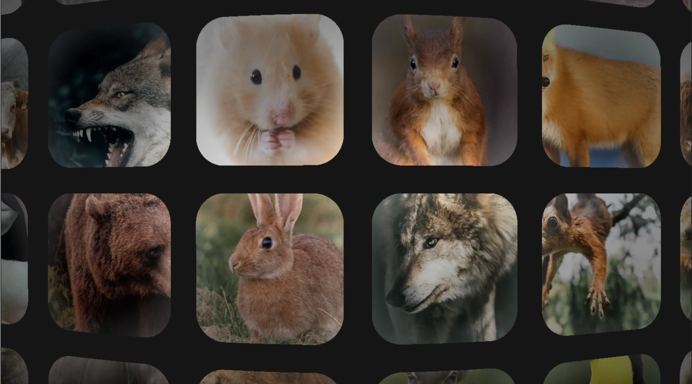

# Toys.031 | WebGL School Task.08 ~ Infinity Gallery using pure WebGL.

## 🪬 ~ 要件

- ポストエフェクトの用法を扱ったので、マウスカーソルの位置に応じて変化するポストエフェクトに挑戦してみよう
  ※ 生 WebGL で実装すること

## 👾 ~ Demo

- https://dev.shoya-kajita.com/031/



<video src="movie1.mp4" loop autoplay muted>

## 🎮 ~ Getting Started

```
// install
npm i

// development
npm run dev

// production
npm run build

// build preview
npm run preview
```

## 📝 ~ Note

- スマホでみれない...
